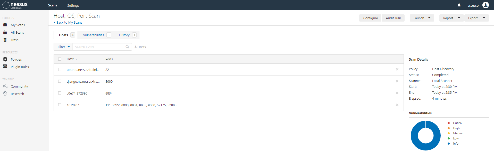
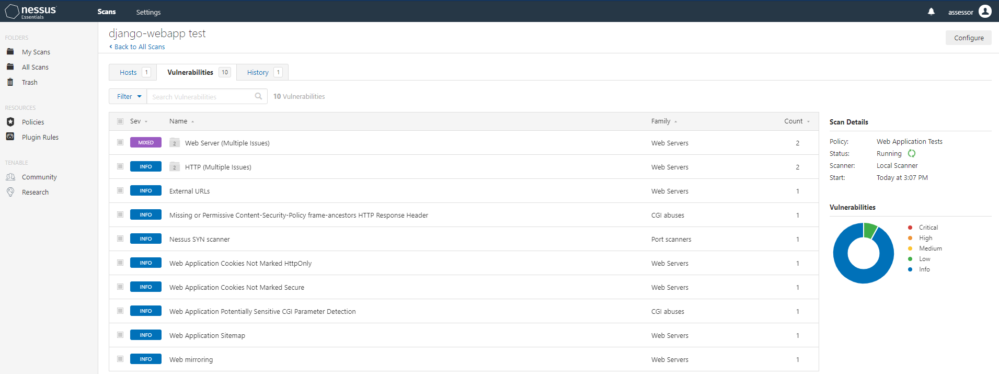
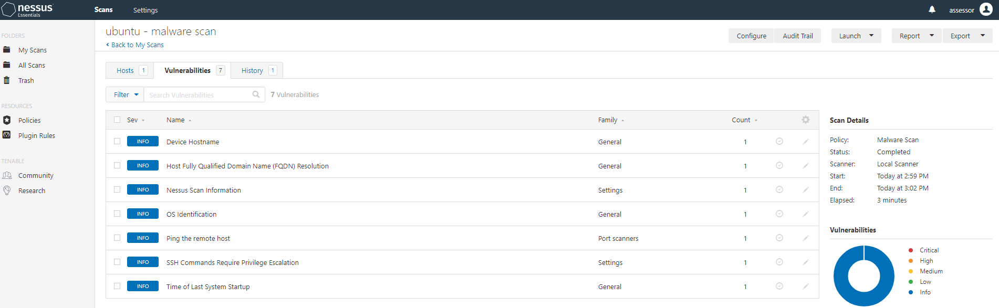

# Nessus-Training
Self-Development project to create training on [Nessus](https://www.tenable.com/products/nessus)

> You'll need a free [license](https://www.tenable.com/products/nessus/nessus-essentials)

[![Build Status][github-image]][github-url] #WIP

## Installation & Run
Linux:
```sh
git clone https://github.com/funkyNet/nessus-training.git
cd nessus-training
docker-compose up -d
```

Windows:
> Leverage WSL2 and Docker Desktop
> https://docs.microsoft.com/en-us/windows/wsl/install-win10


## Access 
Nessus can be found @ https://localhost:8834

Our vulnerable WebApp can be found @ localhost:8835


## Usage example
Once this is running, try...
* Host discovery (network 10.20.0.0/24)


* Web Vuln Scanning (django)


* Host Scanning (ubuntu)



## Release History
* 1.0.0
  * ADD: Created working docker-compose.yml
  * ADD: Created README.md
* #.#.#
   * CHANGE:
   * ADD:
   * FIX: 


## Meta
Matt Funk – [@FunkyInfoSec](https://twitter.com/FunkyInfoSec)
Distributed under the GNU General Public License v3.0 license. See ``LICENSE`` for more information.

## Contributing
1. Fork it (https://github.com/funkyNet/nessus-training/network/members)
2. Create your feature branch (`git checkout -b feature/fooBar`)
3. Commit your changes (`git commit -am 'Add some fooBar'`)
4. Push to the branch (`git push origin feature/fooBar`)
5. Create a new Pull Request

<!-- Markdown link & img dfn's -->
[travis-image]: https://img.shields.io/travis/dbader/node-datadog-metrics/master.svg?style=flat-square
[travis-url]: https://travis-ci.org/dbader/node-datadog-metrics

## Resources
[read-me](https://github.com/dbader/readme-template)
[Nessus](https://www.tenable.com/products/nessus)
[django.nV](https://github.com/secfigo/django.nv)
